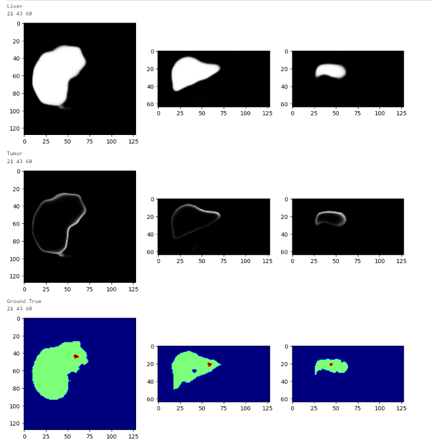
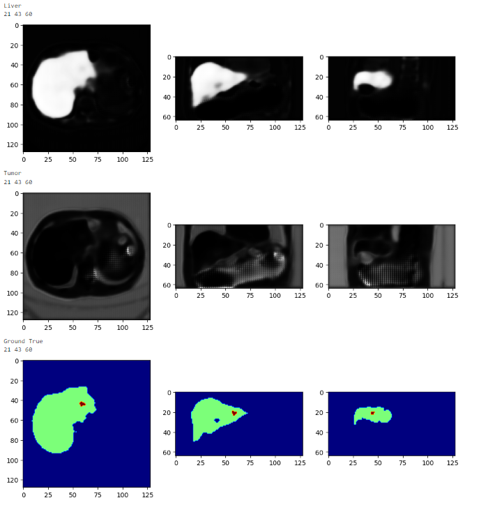
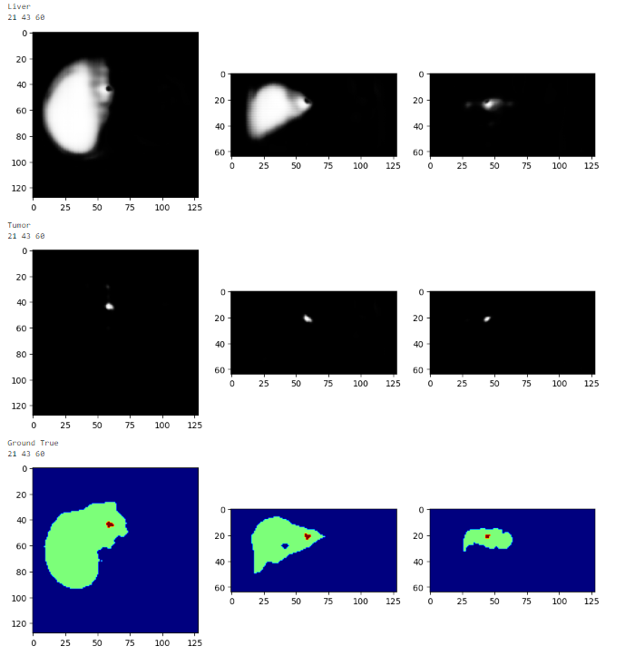

# Liver segmentation with U-net

This repository is my coursework for Advanced Machine Learning at King's College London. Although I did not register it as an official module, I made sure myself to understand all of the mathematical concepts and finished all of its coursework.

This project try to segment livers and liver tumors from 3D volumes of abdominal CT. Important points:

- The data is 3D volumes, with 131 labeled volumetric CT images. ([Data source](http://medicaldecathlon.com/)).

- Each sample is very large: one sample is a tensor of ~ 512x512x512 (512MB/sample).

- The backbone network architecture is [U-net](https://lmb.informatik.uni-freiburg.de/people/ronneber/u-net/), which is implemented from scratch (Coursework requirement).

- The augmentation techniques used: Elastic Deformations, adding Gaussian Noise, and adding Contrast.

- Due to extreme imbalance in the data labels, I decided to combine Dice Loss with Focal Loss for a customed loss function (The ratio of 3 labels are: 14000-1100-1).

## Aims:

Creating a UNet network from scratch to segment livers and liver tumours from CT volumetric image.

## Objectives:

- Segmentation the volumes with UNet from scratch

- Using following data augmentation to improve the network: Elastic Deformations, Noise, Contrast.

- Using Dice Loss as the main loss and adjust it to handle imbalance in the data.

- Implement a stochastic UNet to further predict the uncertainty in the prediction.

## Method:

I designed and tested the network through an iterative approach. Additionally, to make sure the network and the loss function work, I used 1 sample to overfit the model to validate its capacity, to judge the loss function's performance, and to tune the hyperparameters. The project is mainly implemented on [Kaggle](https://www.kaggle.com/).

- The project started with loading the data and create datalsets and dataloaders:

    + Because the files are too big (512MB/1 sample) with a size of 512x512x512, I cropped the depth dimension to remove those without liver and tumors (Resulting in a size of Nx512x512).

    + Nx512x512 volumes are downsampled and interpolated to a size of 64x128x128. The batch size is chosen to be 2 (on 1 GPUs), and 4 (on 2 GPUs). The tensor size is chosen like that to meet the ratio of liver inside human body, while mantaining the batch size >=2 to take advantage of the **batchnorm** layer.
    
    + Because the loading and preprocessing account for a major ammount of time, mumber of worker for each dataloader is chosen to be 8 to ultilize the parallel CPU computing (Experiments are done to find which number of worker run the fastest).

- U-Net: U-Net architecture is referenced from [this paper](https://arxiv.org/abs/1505.04597).

    + My network include 4 downsampling and 4 upsampling layers. The first convolutional layer increase number of channel to 64. Each level comprises two convolutional block followed by downsampling/upsampling layer. In my implementation, the upsampling layers reduce the number of channels by half and followed by 2 convolutional layers mantaining the number of channels (This significantly reduce the number of parameters compared to the original implementation).

    + At first, I tried U-Net without Batchnorm, however, the network did not learn!!! => Batch normalization makes the learning process easier.

    + Later, I noticed the differences between validation and training set are big => I added Dropout to regularize the network to avoid overfitting.

- Data augmentation: The project implemented three data augmentation techniques that were customized for the requirements for the task:

    + Elastic Deformations: it is used to simulate the heterogeneity in the population. It has two parameters: **num_controlpoints** and **sigma**. The **num_controlpoints** defines how detailed the image are splitted into a grid. Each vertex on the grid is a control point that defines the local translations of nearby pixels. These control points are translated randomly following a gaussian distribution with a standard deviation of **sigma**. The **num_controlpoints** and **sigma** are selected through visual validation of different values.

    + Noise: it is used to simulate the noise added during image acquisition and reconstruction. It also reduce the information in the image which would act as a regularization for the network. The function add gaussian noise following a gaussian distribution in each pixel. It has one parameter: **noise_level**, which is the standard deviation of the noise added in each pixel. It is also chosen through visual validation of different values.

    + Contrast: it is used to simulate the different in X-ray absorption. It has three parameters: **central_value**, **contrast_random_level**, and **brightness_random_level**. The pixel values transformation is defined as **new_pixel_value** = (**old_pixel_value**-**central_value**)\***contrast**+**brightness**+**central_value**. The contrast and brightness are sampled from a uniform distribution in \[-**contrast_random_level**, **contrast_random_level**], and \[-**brightness_random_level**, **brightness_random_level**]. By choosing 20 random images and calculate their intensity mean and standard deviation, the **contrast_random_level** is calculate as the *standard deviation* of the *standard deviation*, and **brightness_random_level** is calculated as the *standard deviation* of the *mean*.

- Loss function: due to extreme imbalance of data, I implemented and tested a few loss function: dice loss, dice loss with weights for each class, something similar to dice loss but I sum the dice coefficient of true positives with true negative and weight them with alpha and (1-alpha) respectively, focal loss, my custom loss combining the focal loss with dice loss

    + How I know what loss is good: The training is really long, which is why I only used the loss function only on 1 sample. And see which one overfit the data better. I just crossed my finger to expect them to work that well on the big dataset.

    + Dice Loss or Focal Loss alone: the network doesn't learn how to segment the tumor, even after overfitting 1 sample with 300 epochs.

    

    
     
    + I decided to build my own loss function by combining the Dice Loss with the Focal Loss concept: after 100 epochs, the network overfit 1 sample pretty well! Which is why I decided to go with it.

    

    + Let $d_i$ is a modified dice coefficent for class i, TP, TN, FP, FN is true positive, true negative, false positive, false negative, respectively. The formula the loss function I implemented is:

$$d_i=\alpha * \frac{2* TP}{2*TP+FP+FN} +  (1-\alpha) *\frac{2 *TN}{2 *TN+FN+FP}$$

$$\sum_{i=1}^{n} w_i*(1-d_i)^\gamma*log(d_i)$$

- The hyperparameters I tuned included: learning rate, gamma (in focal loss), alpha (the balance between the true positive and true negative in the loss function).

## Result:

## Usage:

To use the model, download the .py file and the model folder into your working directory. Run:

import ...

Create a new models:

If you want to use my pretrained model:

